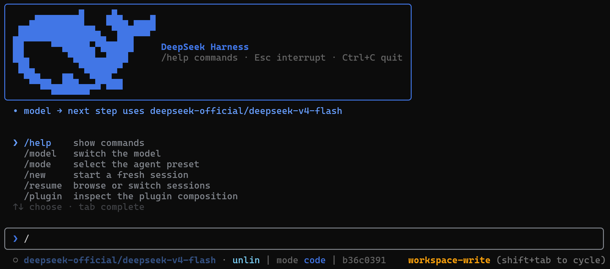
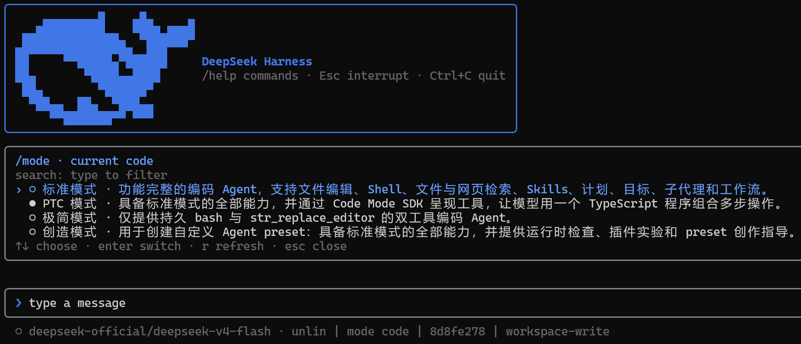
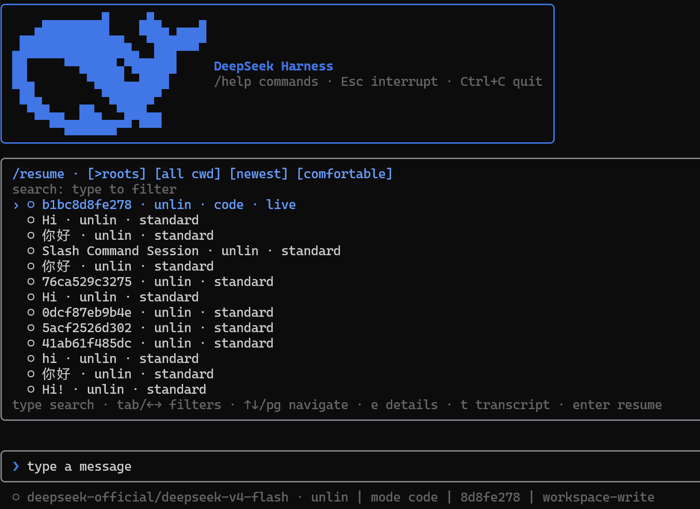

# DSH-Code

English | [中文](README.md)

<p align="center"></p>

<p align="center"></p>
<p align="center">
  <a href="https://github.com/deepseek-ai/deepseek-harness"></a>
  <a href="https://github.com/UNLINEARITY/dsh-code/stargazers"></a>
  <a href="https://www.npmjs.com/package/dsh-code"></a>
  <a href="https://github.com/UNLINEARITY/dsh-code/blob/main/LICENSE"></a>
</p>

**DSH-Code is a terminal coding interface for [DeepSeek Harness](https://github.com/deepseek-ai/deepseek-harness) (`dsh`).** It runs as an out-of-tree bundle over the official `@deepseek-ai/dsh-base` and uses the same Agent, Session, tool, command, skill, permission, sandbox, compaction, and plugin services as the Harness Web UI.

DSH-Code does not implement a separate agent loop. It adds a coding-focused TUI to the DSH runtime, drawing on the session handling of [Codex CLI](https://github.com/openai/codex) and the terminal interaction patterns of [Claude Code](https://code.claude.com/docs/en/overview).

---

## 1. Overview

DeepSeek Harness treats models, tools, storage, policies, and interfaces as plugins registered through Cordis. Durable session events record the conversation and runtime state needed for replay.

DSH-Code keeps that structure and adds a terminal workflow for coding tasks.

| Reference | Used in DSH-Code |
| --- | --- |
| **DeepSeek Harness** | Plugin composition, scoped services, Agent Presets, durable sessions, tools, skills, policies, sandboxing, and delegation |
| **Codex CLI** | Session navigation, bounded overlays, history inspection, stable bottom layout, and resize handling |
| **Claude Code** | Slash-command discovery, thinking folds, approvals, questions, and turn steering |

The interface follows familiar terminal conventions, while runtime behavior continues to come from DSH services and configuration.

## 2. Quick start

Requires Node `^22.19 || >=24` and the preview `dsh` CLI. `DEEPSEEK_API_KEY` is not a startup prerequisite: the TUI, sessions, and non-model features remain available without it; press `a` in `/model` to add an API key through the Harness credentials service.

### 1. First installing

```sh
npm install -g @deepseek-ai/dsh dsh-code
npm install -g pnpm
dsh plugin --profile cli add dsh-code@0.9.1
```

> Note: pnpm ignores packages published less than 24 hours ago, so pin `dsh-code@0.9.1` on the release day; the version can be omitted afterwards. npm installs are not affected.

### 2. Updating

```sh
npm install -g dsh-code@0.9.1
dsh plugin --profile cli add dsh-code@0.9.1
```

### DSH-Code wrapper

DSH-Code is a terminal wrapper over DeepSeek Harness. It does not replace Harness services for Agent, sessions, models, tools, approvals, or persistence; the `cli` profile composes those services with the terminal bundle. `deepseek` and `dsh-code` are convenience aliases for `dsh --profile cli`.

### 3. launching

Available launch commands:

```sh
deepseek
dsh --profile cli
dsh-code
```

`dsh --profile cli`, `deepseek`, and `dsh-code` are parallel launch commands. `deepseek` and `dsh-code` are global aliases for `dsh --profile cli`; all following arguments are forwarded, for example `deepseek --resume abc123`.

> DeepSeek Harness is currently a developer preview and may introduce compatibility-breaking changes. DSH-Code tracks that evolving plugin surface.

For installation, native-module, and plugin-loading issues, see the [troubleshooting guide](docs/problems.md).

## 3. Terminal interaction

### Basics

DSH-Code keeps one Ink owner for the lifetime of the process. `/new` and `/resume` replace the active Agent, not the terminal itself. If a switch is requested while the Agent is busy, it waits for the turn to finish; the newest request wins, and a failed target leaves the current session untouched.

Dynamic content is deliberately bounded. Streaming output, thinking, approvals, questions, `/help`, `/model`, `/mode`, `/resume`, `/plugin`, and Ctrl+O all share terminal-aware viewport rules. The composer remains immediately above the status line. After a resize, the screen is redrawn from the stored transcript once the new width settles.

Use `/mode` before the first turn to inspect or select the session's Agent Preset.

<p align="center"></p>

Use `/resume` to search persisted sessions without restarting the TUI.

<p align="center"></p>

### Common commands

```sh
dsh --profile cli                    # start a fresh standard session
dsh --profile cli --mode code        # start with an Agent Preset
dsh --profile cli --continue         # resume the newest session for this directory
dsh --profile cli --resume abc123    # resume by id or unique prefix
dsh --profile cli --session my-id    # start a fresh session with an explicit id
deepseek setup                        # mount the current release in the cli profile
deepseek doctor                       # check Node, DSH, profile, and composition
deepseek completion powershell       # generate shell completion
deepseek update                       # check available versions only
deepseek update --apply               # explicitly update the global install
```

Inside the TUI:

| Action | Purpose |
| --- | --- |
| `/new [preset]` | Create and enter another session without restarting the terminal |
| `/resume [id\|prefix]` | Search root sessions or all conversations; filter by cwd, order, and density |
| `/fork [event-seq]` | Create a resumable ordinary fork from a completed turn containing the event |
| `/mode [preset]` | Inspect or select the blank session's Agent composition |
| `/model` | Switch among live-registry models; press `a` to manage providers, then `Tab` to edit URL, models, and windows |
| `/plugin [query]` | Inspect loader entries, enabled state, module identity, and fiber phase |
| `/diff [--staged\|ref]` | Inspect the complete Git diff by file; left/right switches files |
| `/review [--staged\|ref]` | Submit a bounded code review after switching to `read-only` permissions |
| `/copy` | Copy the latest complete assistant response |
| `/permission <name>` | Change the permission preset; Shift+Tab cycles presets |
| `/help` | Browse local commands, Harness commands, skills, and key bindings |
| `Ctrl+O` | Open the exclusive history detail view; switch entries and scroll all content |
| `Ctrl+R` | Fold or reveal model reasoning |
| `@` | Mention workspace files or bounded snapshots of persisted sessions |
| `Esc` / `Ctrl+C` | Close the topmost surface or interrupt the active turn |

Press `a` in `/model` to manage providers; press `Tab` on a provider to edit its endpoint URL, explicit model allow-list, and per-model context/output windows. Typed API keys stay masked and are handed directly to Harness persistence. Keys supplied by the launch environment are read-only and cannot be overwritten or removed in the TUI.

## 4. Features

### 1. Agent and extensions

- Per-session Agent Presets for tools, prompt sections, skills, compaction, plan mode, and delegation
- Live slash-command and skill discovery from shared Harness registries
- Read-only Cordis loader diagnostics through `/plugin`
- Model routing through the live LLM registry, restored per persisted session; `/model` can add or rotate keys, remove writable keys, delete user-added provider profiles, and set an endpoint, explicit model allow-list, and token windows
- Plans, goals, todos, permissions, sandbox state, subagents, and runtime steering

### 2. Sessions and context

- `/new`, `/resume`, `/fork`, `--continue`, and explicit session identifiers without remounting Ink
- Codex-style searchable resume panel with root/all-conversation, cwd, order, and density filters
- Bare launches defer session creation until your first real input; quitting early leaves nothing behind
- Global input recall: Up/Down walks past prompts across sessions, and `/history` searches and fills the composer
- Lazy title snapshots and explicitly loaded, fully scrollable transcripts
- Read-only subagent conversation inspection and bounded `@` session references
- Initial prompts and repeated `--image`; Harness persists image bytes in its attachment store and records content-addressed references in session events
- Markdown export, persistent titles, context occupancy, cache, token, TTFT, and timing metrics

### 3. Approvals and interaction

- One-shot tool approval bar for sandbox escalation and hook `ask` decisions
- Structured `ask_user_question` and plan-review menus with multi-select and custom answers
- Turn steering at the next step boundary plus explicit interruption semantics
- Independent Agent mode, plan state, permission preset, goal, and sandbox indicators

### 4. Terminal rendering

- Append-only settled transcript with bounded mutable streaming output
- Folded thinking, terminal Markdown, compact tool summaries, and full structured details
- Two-row status bar with mode and context on the second row, a blue context-occupancy meter, and all-blue accents
- Submissions while a turn runs appear immediately as ordinary prompt rows; Delete cancels the newest queued message, and busy states use the web StateDot chase animation
- Replies align with the input cursor, and the welcome header shows the installed version with the bilingual slogan “Into the Unknown  探索未至之境”
- Ctrl+O exclusive history inspection with entry navigation and complete vertical scrolling
- Width-safe CJK/control-character handling, compact-terminal degradation, and debounced resize replay
- Stable bottom order: content or panel → notice → composer → status

#### DeepSeek model-switch animations

Switching to a DeepSeek route, or changing reasoning effort on the same route, randomly plays Wave, Aurora, or Pulse across the composer without repeating the previous style. Flash models use the single-band tier; other DeepSeek models use the richer multi-band tier.

| Style | Flash | DeepSeek |
| --- | --- | --- |
| Wave | One blue crest sweeps left to right, 1.2s | Two offset crests, 1.5s |
| Aurora | Two blue light bands drift sinusoidally, 1.5s | Three differently hued bands, 1.8s |
| Pulse | One ring expands from the composer center, 1.1s | Two sequential expanding rings, 1.45s |

The animation runs locally in the composer at about 30 FPS. Its background and border return to rest afterward while the DeepSeek-tier prompt marker remains.

## 5. How DSH-Code integrates with DSH

### 1. Runtime composition

DSH-Code reads the live Harness registries instead of maintaining separate copies. Model adapters, tool providers, skill sources, commands, permission policies, persistence backends, sandboxes, and subagent providers can be added or replaced through DSH composition.

`/plugin` provides a read-only view of the current Cordis loader state.

### 2. Session-scoped Agent Presets

The Host owns shared infrastructure—registries, persistence, session queries, permissions, and sandbox policy—while each session receives an isolated Agent scope composed from an **Agent Preset**:

- `standard` — the full general-purpose coding agent
- `code` — Code Mode / PTC-oriented multi-operation workflows
- `minimal` — only persistent shell access and `str_replace_editor`
- `cordis` — the full agent plus runtime inspection and preset-authoring guidance
- user presets — your own tools, prompt sections, skills, compaction, plan mode, and subagent behavior

Use `/mode` before the first turn or start directly with `--mode <preset>`. The selected preset is written to the session and restored on resume.

### 3. Session history and replay

Prompts, streamed chunks, tool calls and results, model choices, plan state, permissions, titles, and preset selections are projected from durable Session events. Resume, export, history inspection, context accounting, and terminal replay use the same record.

React state is limited to temporary interface details such as the input draft, cursor, open panel, selection, and scroll position.

```text
dsh profile
└─ Host plane: registries · persistence · query · permissions · sandbox
   ├─ Agent session A + preset code
   ├─ Agent session B + preset minimal
   └─ DSH-Code TUI
      durable events → pure projection → append-only transcript
                                  └→ bounded panels → composer → status
```

## 6. Development

```sh
pnpm install
pnpm test
pnpm typecheck
pnpm build
pnpm run gen:whale   # regenerate src/whale-glyph.ts from the vendored logo path
```

The whale glyph is generated from the DeepSeek FishLogo geometry vendored in `scripts/fish-logo.ts` (source: DeepSeek Harness, MIT).

### 1. Source development installation

For a local checkout:

```sh
dsh plugin --profile cli add file:C:/path/to/dsh-code
```

GitHub installation is available for source development:

```sh
dsh plugin --profile cli add github:unlinearity/dsh-code
```

The Git package builds during installation. If pnpm asks for an `allowBuilds` entry, copy the complete entry it prints into `~/.dsh/profiles/cli/pnpm-workspace.yaml`, then run the command again. The key includes the Git URL and commit, so do not replace it with only `dsh-code`.

### 2. Uninstall

```sh
dsh plugin --profile cli remove dsh-code   # unmount the plugin from the cli profile
npm uninstall -g dsh-code                  # remove the global package and the deepseek / dsh-code commands
```

Both steps are required for a full removal: the first only unmounts the profile — the `deepseek` command still exists afterwards and reports "the cli profile does not mount dsh-code yet" — while the second removes the global npm package and its launch aliases. Uninstalling does not touch `@deepseek-ai/dsh` itself or persisted session data.

### 3. References

- Runtime services, events, plugin scopes, and persistence follow **DeepSeek Harness**.
- Session navigation, popup sizing, scrollback, bottom-pane layout, and resize behavior refer to **Codex CLI**.
- Slash discovery, turn steering, thinking folds, approvals, and question flows refer to **Claude Code**.

DSH-Code is an independent MIT-licensed community project and is not affiliated with OpenAI or Anthropic.

Communities:
- [Linux DO](https://linux.do/): Learn AI, head to L Station!
- [Deepseek harness](https://www.deepseek.com/harness): DSH official website.

## License

[MIT](LICENSE). The vendored FishLogo geometry is from DeepSeek Harness (MIT).
