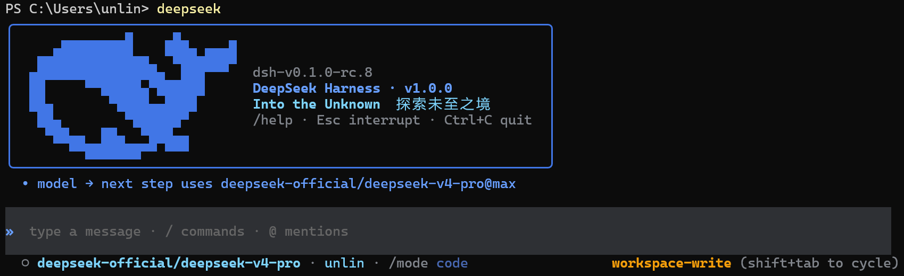
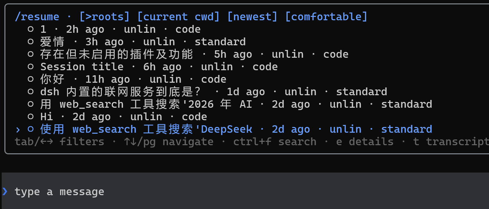
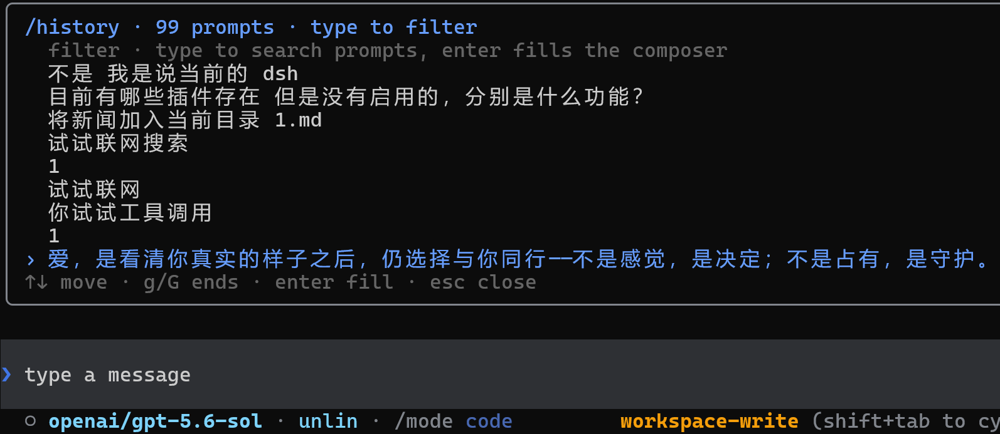
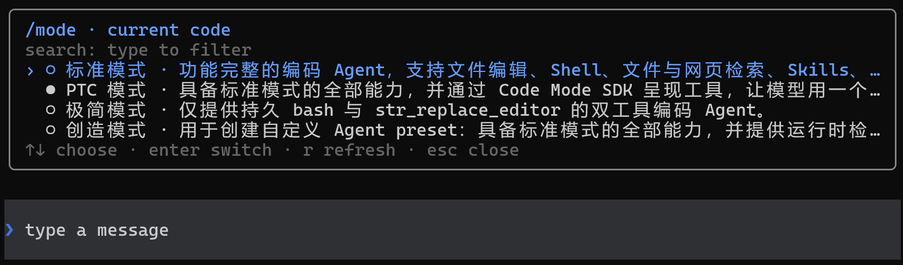

# DSH-Code

[English](README.en.md) | 中文

<p align="center"></p>

<p align="center"></p>
<p align="center">
  <a href="https://github.com/deepseek-ai/deepseek-harness"></a>
  <a href="https://www.npmjs.com/package/@deepseek-ai/dsh"></a>
  <a href="https://github.com/UNLINEARITY/dsh-code/stargazers"></a>
  <a href="https://www.npmjs.com/package/dsh-code"></a>
  <a href="https://github.com/UNLINEARITY/dsh-code/blob/main/LICENSE"></a>
</p>

---

## 一、项目概览

**DSH-Code 是 [DeepSeek Harness](https://github.com/deepseek-ai/deepseek-harness)（`dsh`）的终端编码界面。** 它以树外 bundle 的形式组合在官方 `@deepseek-ai/dsh-base` 之上，与 Harness Web UI 使用同一套 Agent、Session、工具、命令、技能、权限、sandbox、上下文压缩与插件服务。

DeepSeek Harness 将模型、工具、存储、策略和界面作为插件，通过 Cordis 注册。持久化会话事件记录恢复对话与运行状态所需的信息。DSH-Code 保留这套结构，并补充适合编码任务的终端工作流。界面采用开发者熟悉的终端操作方式，运行行为仍由 DSH 服务和配置决定。

## 二、快速开始

需要 Node `^22.19 || >=24` 和预览版 `dsh` CLI（当前版本线：`@deepseek-ai/dsh@0.1.1-rc.2`）。未配置模型时仍可进入 TUI、查看会话和使用非模型功能；在 `/model` 中按 `a` 可管理 API key、OAuth 与设备码登录。

### 1. 安装与更新

初次安装和更新使用同一组指令：

```sh
npm install -g @deepseek-ai/dsh@0.1.1-rc.2 dsh-code@1.0.2
npm install -g pnpm
dsh plugin --profile cli add dsh-code@1.0.2
```

> 提示：pnpm 会忽略发布不足 24 小时的包，因此发布首日请使用精确版本 `dsh-code@1.0.2`；24 小时后可省略版本号。npm 安装不受此限制。
>
> 版本对齐：dsh-code 1.0.2 面向 dsh `0.1.1-rc.2` 构建，全部 Harness 依赖均精确锁定为 `0.1.1-rc.2`。请保持全局 dsh 与 dsh-code 同步，避免宿主与插件混用候选版本。rc.2 已删除旧的 DeepSeek 配置项 `maxRequestImageBytes`。

### 2. 启动指令

可用的启动指令：
```sh
dsh --profile cli
deepseek
dsh-code
```

`dsh --profile cli`、`deepseek` 与 `dsh-code` 是并列的启动命令。`deepseek` 与 `dsh-code` 都是 `dsh --profile cli` 的全局别名，后续参数会原样转发，例如 `deepseek --resume abc123`。


> DeepSeek Harness 目前仍处于 developer preview，可能出现破坏兼容性的变化；DSH-Code 会持续跟随其插件接口演进。

安装、原生模块和插件加载问题，请查看[常见问题与排障](docs/problems.md)。

## 三、核心功能与使用方式

DSH-Code 的重点是让 DSH 的 Agent、模型、工具和持久会话可以直接在终端中使用，并覆盖从编写代码到审查修改的完整工作流。

### 1. 会话管理

- 使用 `/new` 新建会话，或通过 `/resume`、`--continue` 恢复已有会话
- 使用 `/fork` 从历史节点创建新的工作分支，同时保留原会话
- 按当前目录、更新时间和会话范围搜索历史记录
- 使用 Up/Down 召回输入历史，或通过 `/history` 搜索过去的提示词
- 支持持久标题、Markdown 导出、上下文占用、token、缓存、TTFT 和耗时统计
- 恢复会话时同步恢复该会话使用的 Agent Preset 和模型选择

<p align="center"></p>

<p align="center"></p>

### 2. Agent、模型与扩展

- 每个会话可以选择独立的 Agent Preset，用于组合工具、提示词、技能、上下文压缩、plan mode 和 subagent 能力
- 使用 `/mode` 选择 `standard`、`code`、`minimal`、`cordis` 或用户自定义 Preset
- 使用 `/model` 切换模型，管理 provider、API key、OAuth/设备码登录、endpoint、可用模型和上下文窗口
- 在 `/model` 的 provider 列表中，Enter 管理手动 API key，`l` 发起登录，`o` 经确认后退出登录
- 自动加载 DSH 中可用的命令与技能；使用 `/help` 查看入口，使用 `/plugin` 检查扩展状态
- 支持 plan、goal、todo、权限、sandbox、subagent 和运行中的补充指令

<p align="center"></p>

### 3. 模型切换动画

模型或 reasoning effort 发生以下变化时，输入框会播放 Wave、Aurora 或 Pulse：

| 使用场景 | 触发条件 | 动画文字 | 效果档位 |
| --- | --- | --- | --- |
| 官方 DeepSeek 模型 | 切换到该模型，或修改该模型的 reasoning effort | `deepseek` | Flash 使用单波段档位，其他 DeepSeek 模型使用多波段档位 |
| 其他模型 | 切换模型或 reasoning effort 后，实际生效的强度严格高于 `high` | `Into the Unknown` | 使用与非 Flash DeepSeek 模型相同的多波段档位 |

高于 `high` 的等级包括 `xhigh`、`x-high`、`very-high`、`max`、`maximum` 和 `ultra`；`high`、`medium`、`low` 与 `off` 不会为非 DeepSeek 模型触发动画。

| 样式 | Flash | 其他 DeepSeek / `Into the Unknown` |
| --- | --- | --- |
| Wave | 一个蓝色波峰从左向右扫过，约 1.2 秒 | 两个错开的蓝色波峰依次扫过，并带有 `· ✦ ✧` 尾部星光，约 1.5 秒 |
| Aurora | 两条蓝色光带交错漂移，约 1.5 秒 | 三条不同色调的光带交错漂移，约 1.8 秒 |
| Pulse | 一个圆环从输入框中心向外扩散，约 1.1 秒 | 两个圆环先后向外扩散，约 1.45 秒 |

### 4. 编码工作流

- 使用 `@` 引用工作区文件或已有会话；选择 PNG、JPEG、WebP、GIF 时会自动作为真实图片附件
- 支持启动 prompt、多个 `--image` 参数，以及从终端拖入一张或多张图片
- 使用 `/diff` 按文件检查改动，使用 `/review` 发起只读代码审查
- 使用 `/copy` 复制最近一条完整回复，使用 Ctrl+O 查看完整历史和工具详情
- 支持工具审批、结构化提问、plan review、多选和自定义答案
- 使用权限 Preset 和 sandbox 控制 Agent 可以执行的操作；任务运行中仍可补充指令或中断

### 5. 命令与快捷键

启动 TUI：

```sh
dsh --profile cli                    # 新建 standard 会话
dsh --profile cli --mode code        # 使用指定 Agent Preset 启动
dsh --profile cli --continue         # 恢复当前目录最新会话
dsh --profile cli --resume abc123    # 按 id 或唯一前缀恢复会话
dsh --profile cli --session my-id    # 使用指定 id 新建会话
```

进入 TUI 后，可以使用以下内置命令。当前 profile 提供的其他 Harness 命令和用户技能会随安装内容变化，完整列表以 `/help` 显示为准。

#### 会话与记录

| 命令 | 用途 |
| --- | --- |
| `/new [preset]` | 创建新会话，可同时指定 Agent Preset |
| `/resume [id\|前缀]` | 搜索或恢复已有会话 |
| `/resume cancel` | 取消正在等待的会话切换 |
| `/fork [event-seq]` | 从最近完成的 turn 或指定事件位置创建分支会话 |
| `/delete [id\|前缀]` | 删除指定会话及其 subagent 会话 |
| `/title <text>` | 修改当前会话标题 |
| `/export [path]` | 将当前会话导出为 Markdown |
| `/history` | 搜索并复用过去提交的提示词 |
| `/clear` | 清空当前终端显示，不删除持久会话 |

#### Agent、模型与权限

| 命令 | 用途 |
| --- | --- |
| `/mode [preset]` | 查看或选择当前会话的 Agent Preset |
| `/model` | 切换模型，管理 provider、API key、网页登录、endpoint 和可用模型 |
| `/effort` | 调整当前模型的 reasoning effort |
| `/permission [preset]` | 查看或切换权限 Preset |
| `/subagent` | 选择 subagent 执行任务时使用的模型 |

#### 编码、任务与后台工作

| 命令 | 用途 |
| --- | --- |
| `/diff [--staged\|ref]` | 按文件查看工作区、暂存区或指定 ref 的 Git diff |
| `/review [--staged\|ref]` | 使用只读权限审查 Git 改动 |
| `/todos` | 查看当前会话的完整 todo 列表 |
| `/agents` | 查看当前会话创建的 subagent 会话 |
| `/jobs` | 查看后台任务及其运行状态 |
| `/copy` | 复制最近一条完整助手回复 |

#### 扩展、显示与退出

| 命令 | 用途 |
| --- | --- |
| `/plugin [query]` | 查看已加载扩展及其状态 |
| `/statusline` | 选择状态栏显示的项目 |
| `/vscode-keys` | 将 Ctrl+R 放行进 VS Code 系终端（幂等写入用户级 keybindings.json） |
| `/theme` | 切换终端配色主题 |
| `/help` | 查看快捷键、内置命令、Harness 命令和用户技能 |
| `/quit` | 退出 DSH-Code |

#### 输入与快捷键

| 操作 | 用途 |
| --- | --- |
| `Enter` | 提交当前输入 |
| `Up` / `Down` | 召回上一条或下一条输入记录 |
| `Tab` | 补全命令、技能或 `@` 引用 |
| `@` | 引用工作区文件或已有会话；图片文件自动作为附件发送 |
| `Ctrl+O` | 查看完整历史与工具详情 |
| `Ctrl/Alt+R` | 折叠或展开思考过程；VS Code 系终端先运行 /vscode-keys 放行 Ctrl+R |
| `Shift+Tab` | 循环切换权限 Preset |
| `Delete` | 输入框为空时，取消最新一条排队消息 |
| `Ctrl+K` | 删除光标到行尾的内容 |
| `Ctrl+U` | 清空当前输入行 |
| `Ctrl+A` / `Ctrl+E` | 移动到当前行开头或结尾 |
| `Esc` | 关闭当前菜单或中断正在运行的 turn |
| `Ctrl+C` | 依次用于取消任务、清空输入或退出 |
| `Ctrl+D` | 退出 DSH-Code |

#### 状态指示

| 指示 | 触发条件 |
| --- | --- |
| `✻ Deep diving...` | 回合运行中且当前没有内容流出（等待首个输出、工具执行间隙）；超过 15 秒追加计时 |
| `✻ Thinking…` | 模型思考内容正在流出；默认折叠为动效占位行，`Ctrl/Alt+R` 展开正文 |

## 四、DSH-Code 如何接入 DSH

### 1. 运行时组合

DSH-Code 读取 Harness 的实时注册表，不在本地维护另一套副本。模型适配器、工具 provider、技能来源、命令、权限策略、持久化后端、sandbox 和 subagent provider 都可以通过 DSH composition 添加或替换。

`/plugin` 提供当前 Cordis loader 状态的只读视图。

### 2. 会话级 Agent Preset

Host 持有共享基础设施——注册表、持久化、会话查询、权限和 sandbox 策略；每个会话则获得一个隔离的 Agent scope，并由 **Agent Preset** 进行组合：

- `standard`——功能完整的通用编码 Agent
- `code`——面向 Code Mode / PTC 的多操作工作流
- `minimal`——只保留持久 shell 和 `str_replace_editor`
- `cordis`——完整 Agent，加上运行时检查与 Preset 编写指导
- 用户预设——自行定义工具、提示词段落、技能、上下文压缩、plan mode 与 subagent 行为

在第一次 turn 之前使用 `/mode`，或通过 `--mode <preset>` 直接启动。选中的 preset 会写入会话，并在恢复时还原。

### 3. 会话记录与恢复

提示词、流式 chunk、工具调用与结果、模型选择、plan 状态、权限、标题和 preset 选择都由持久 Session 事件投影得到。会话恢复、导出、历史检查、上下文统计和终端重放使用同一份记录。

React state 只保存输入草稿、光标、当前面板、选中项和滚动位置等临时界面状态。

```text
dsh profile
└─ Host plane：注册表 · 持久化 · 查询 · 权限 · sandbox
   ├─ Agent 会话 A + preset code
   ├─ Agent 会话 B + preset minimal
   └─ DSH-Code TUI
      持久事件 → 纯投影 → 只追加的历史转录
                         └→ 有界面板 → 输入框 → 状态栏
```

## 五、开发

```sh
pnpm install
pnpm test
pnpm typecheck
pnpm build
pnpm run gen:whale   # 从 vendored Logo 路径重新生成 src/whale-glyph.ts
```

鲸鱼字形由 `scripts/fish-logo.ts` 中 vendored 的 DeepSeek FishLogo 几何数据生成（来源：DeepSeek Harness，MIT）。

### 1. 源码开发安装

本地 checkout 可使用：

```sh
dsh plugin --profile cli add file:C:/path/to/dsh-code
```

GitHub 安装可用于源码开发：

```sh
dsh plugin --profile cli add github:unlinearity/dsh-code
```

Git 包会在安装阶段构建。若 pnpm 要求添加 `allowBuilds`，请把它输出的完整条目复制到 `~/.dsh/profiles/cli/pnpm-workspace.yaml`，再重新执行命令。该键包含 Git URL 与 commit，不能只写 `dsh-code`。

### 2. 卸载

```sh
dsh plugin --profile cli remove dsh-code   # 移除 cli profile 中的插件挂载
npm uninstall -g dsh-code                  # 移除全局包与 deepseek / dsh-code 命令
```

两条都要执行才是全量卸载：第一条只解除 profile 挂载，此时 `deepseek` 命令仍存在并提示 "the cli profile does not mount dsh-code yet"；第二条移除全局 npm 包与启动别名。卸载不影响 `@deepseek-ai/dsh` 本体与已持久化的会话数据。

### 3. 参考

- 运行时服务、事件、插件作用域和持久化模型遵循 **DeepSeek Harness**。
- 会话导航、浮层尺寸、scrollback、底部布局与缩放处理参考 **Codex CLI**。
- 斜杠发现、turn steering、思考折叠、审批和提问流程参考 **Claude Code**。

DSH-Code 是独立的 MIT 社区项目，与 OpenAI 或 Anthropic 无隶属关系。

社区：
- [Linux DO](https://linux.do/)：学 AI，上 L 站！
- [Deepseek harness](https://www.deepseek.com/harness): DSH 官方网站

## 许可

[MIT](LICENSE)。vendored FishLogo 几何数据来自 DeepSeek Harness（MIT）。
