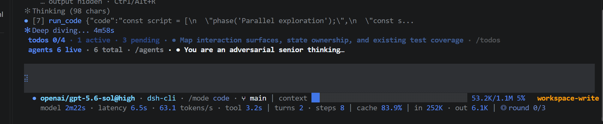

# DSH-Code

[English](README.en.md) | 中文

<p align="center"></p>

<p align="center"></p>
<p align="center">
  <a href="https://github.com/deepseek-ai/deepseek-harness"></a>
  <a href="https://www.npmjs.com/package/@deepseek-ai/dsh"></a>
  <a href="https://github.com/UNLINEARITY/dsh-code/stargazers"></a>
  <a href="https://www.npmjs.com/package/dsh-code"></a>
  <a href="https://github.com/UNLINEARITY/dsh-code/blob/main/LICENSE"></a>
</p>

---

> 注：自 DSH-Code 1.0.0 起，代码由 DSH-Code 自迭代完善，不使用外部 Agent / CLI 完成！

## 一、项目概览

**DSH-Code 是 [DeepSeek Harness](https://github.com/deepseek-ai/deepseek-harness)（`dsh`）的终端编码界面。** 它以树外 bundle 的形式组合在官方 `@deepseek-ai/dsh-base` 之上，与 Harness Web UI 使用同一套 Agent、Session、工具、命令、技能、权限、sandbox、上下文压缩与插件服务。

DeepSeek Harness 将模型、工具、存储、策略和界面作为插件，通过 Cordis 注册。持久化会话事件记录恢复对话与运行状态所需的信息。DSH-Code 保留这套结构，并补充适合编码任务的终端工作流。界面采用开发者熟悉的终端操作方式，运行行为仍由 DSH 服务和配置决定。

## 二、快速开始

需要 Node `^22.19 || >=24` 和预览版 `dsh` CLI（当前版本线：`@deepseek-ai/dsh@0.1.5-rc.2`）。未配置模型时仍可进入 TUI、查看会话和使用非模型功能；在 `/model` 中按 Tab 进入供应商管理，配置 API key、OAuth 与设备码登录。

### 1. 安装与更新

初次安装和更新使用 GitHub Release tarball（打 tag 时 CI 构建并挂到 Release，lib 已预构建，安装机无需工具链）。npm 渠道仍暂停；`/update` 与 `deepseek update --apply` 只查询 npm，此时请不要用它们升级，按下面的 URL 重装即可：

```sh
npm install -g @deepseek-ai/dsh@0.1.5-rc.2 pnpm
npm install -g https://github.com/unlinearity/dsh-code/releases/download/1.1.0/dsh-code-1.1.0.tgz
dsh plugin --profile cli add https://github.com/unlinearity/dsh-code/releases/download/1.1.0/dsh-code-1.1.0.tgz
```

> npm 脚本提示：npm 11.6+ 可能在全局安装时提示 `npm warn install-scripts`（node-pty、koffi 等原生依赖的构建脚本未获批准）。宿主随包自带预编译产物，常规平台可直接忽略；若安装后出现原生模块报错，按 npm 提示执行 `npm install -g --allow-scripts=<包名列表>` 后重装。
>
> 版本对齐：dsh-code 面向 dsh `0.1.5-rc.2` 构建，全部 Harness 依赖均精确锁定为 `0.1.5-rc.2`。本地 `link:` 挂载请先 `git pull && pnpm install && pnpm build`，不要对开发挂载跑更新器。
>
> 升级说明：旧会话与旧参数中记录的 `code` 预设会自动映射到上游已改名的 `ptc`，无需手动迁移。会话日志读取端随上游升级到格式 v3：旧格式日志在读取时由内核自动迁移，磁盘上的原始文件保持不变。
>
> 通过 GitHub 安装的版本会领先 npm。更新器只认 npm，因此会显示「新于 npm，不降级」，而不是「已是最新」。npm 恢复后再用 `/update`。

npm 渠道恢复后可改用：

```sh
npm install -g @deepseek-ai/dsh@0.1.5-rc.2 pnpm
npm install -g dsh-code@1.1.0
dsh plugin --profile cli add dsh-code@1.1.0
```

### 2. 启动指令

可用的启动指令：
```sh
dsh --profile cli
deepseek
dsh-code
```

`dsh --profile cli`、`deepseek` 与 `dsh-code` 是并列的启动命令。`deepseek` 与 `dsh-code` 都是 `dsh --profile cli` 的全局别名，后续参数会原样转发，例如 `deepseek --resume abc123`。


> DeepSeek Harness 目前仍处于 developer preview，可能出现破坏兼容性的变化；DSH-Code 会持续跟随其插件接口演进。

安装、原生模块和插件加载问题，请先运行 `deepseek doctor` 自检，更多排查见[常见问题与排障](docs/problems.md)。

## 三、核心功能与使用方式

DSH-Code 的重点是让 DSH 的 Agent、模型、工具和持久会话可以直接在终端中使用，并覆盖从编写代码到审查修改的完整工作流。

### 1. 会话管理

- 使用 `/new` 新建会话，或通过 `/resume`、`--continue` 恢复已有会话
- 使用 `/fork` 从历史节点创建新的工作分支，同时保留原会话
- 按当前目录、更新时间和会话范围搜索历史记录
- 使用 Up/Down 召回输入历史（含 / 指令），或通过 `/history` 搜索过去的提示词与指令
- 支持持久标题、Markdown 导出、上下文占用、token、缓存、TTFT 和耗时统计
- 恢复会话时同步恢复该会话使用的 Agent Preset、模型选择和子代理列表；欢迎页同时显示 dsh 与 dsh-code 版本

<p align="center"></p>

<p align="center"></p>

### 2. Agent、模型与扩展

- 每个会话可以选择独立的 Agent Preset，用于组合工具、提示词、技能、上下文压缩、plan mode 和 subagent 能力
- 使用 `/mode` 选择 `standard`、`ptc`、`minimal`、`cordis` 或用户自定义 Preset（旧名称 `code` 自动映射到 `ptc`）
- 使用 `/model` 切换模型，管理 provider、API key、OAuth/设备码登录、endpoint、可用模型和上下文窗口；`Tab` 进入 provider 管理（已配置供应商置顶分组），任意阶段 `Ctrl+C` 直接退出整个 /model 流程
- 在 provider 列表中，Enter 进入统一配置页：同页填写 API key 与 endpoint（留空即官方默认）、编辑已添加模型的上下文/输出窗口，`Tab` 进入发现页拉取端点真实可用模型并勾选添加
- 在统一配置页的模型行上按 `e` 编辑推理档位声明（格式 `low:low high:high max:max`，`false` 禁用、留空恢复继承），按 `c` 从其他已声明模型逐字复制——例如 GLM 系列按官方三档写 `low:low high:high max:max`，新模型（如 gpt-6）可一键复制 gpt-5.6 的映射
- 在 provider 列表中 `l` 发起登录，`o` 经确认后退出登录
- 自动加载 DSH 中可用的命令与技能；使用 `/help` 查看入口，使用 `/plugin` 检查扩展状态
- 支持 plan、goal、todo、权限、sandbox、subagent 和运行中的补充指令

<p align="center"></p>

<p align="center"></p>

### 3. 模型切换动画

模型或 reasoning effort 发生以下变化时，输入框会播放 Wave、Aurora 或 Pulse：

| 使用场景 | 触发条件 | 动画文字 | 效果档位 |
| --- | --- | --- | --- |
| 官方 DeepSeek 模型 | 切换到该模型，或修改该模型的 reasoning effort | `deepseek` | Flash 使用单波段档位，其他 DeepSeek 模型使用多波段档位 |
| 其他模型 | 切换模型或 reasoning effort 后，实际生效的强度严格高于 `high` | `Into the Unknown` | 使用与非 Flash DeepSeek 模型相同的多波段档位 |

高于 `high` 的等级包括 `xhigh`、`x-high`、`very-high`、`max`、`maximum` 和 `ultra`；`high`、`medium`、`low` 与 `off` 不会为非 DeepSeek 模型触发动画。

| 样式 | Flash | 其他 DeepSeek / `Into the Unknown` |
| --- | --- | --- |
| Wave | 一个蓝色波峰从左向右扫过，约 1.2 秒 | 两个错开的蓝色波峰依次扫过，并带有 `· ✦ ✧` 尾部星光，约 1.5 秒 |
| Aurora | 两条蓝色光带交错漂移，约 1.5 秒 | 三条不同色调的光带交错漂移，约 1.8 秒 |
| Pulse | 一个圆环从输入框中心向外扩散，约 1.1 秒 | 两个圆环先后向外扩散，约 1.45 秒 |

### 4. 编码工作流

- 使用 `@` 引用工作区文件或已有会话；选择 PNG、JPEG、WebP、GIF 时会自动作为真实图片附件
- 支持启动 prompt、多个 `--image` 参数，以及从终端拖入或粘贴附件：图片按图片附件发送，其他文件按原样文件附件发送（单文件 8 MiB、每条消息 8 个以内）
- 使用 `/diff` 按文件检查改动，使用 `/review` 发起只读代码审查（弹出范围选择，diff 整行红绿着色）
- `run_code` 会列出正在执行的子工具调用；workflow 会列出各成员直到结束
- 使用 `/copy` 复制最近一条完整回复，使用 Ctrl+O 查看完整历史和工具详情
- 支持工具审批、结构化提问、plan review、多选和自定义答案
- 使用权限 Preset 和 sandbox 控制 Agent 可以执行的操作；任务运行中仍可补充指令或中断

### 5. 排队与插队

回合运行中你还可以继续输入消息，有两种发送方式：

- **排队**：等这一回合全部结束后，作为新的一回合处理。适合「做完这件再做下一件」。
- **插队**：在这一回合的下一个步骤开始之前交给模型，和当前这次请求一起处理。适合发现它做偏了、要立刻纠正或补充要求。

两者的区别是**模型什么时候能看到它**：排队是等它做完再说，插队是在它下一步动手之前就告诉它。

怎么用：

- 输入框空着按 `Tab` 在两种方式之间切换。提示符（`❯` / `↳`）、空输入框的提示文字和切换时的通知都会写明当前是哪一种；输入框有内容时 `Tab` 仍是补全。
- `/queue` 打开队列面板：对某条按回车即可改为插队，按 `e` 改文字（附件原样保留），按 `d` 删除。
- 输入框空着按 `Delete`，直接取消最新一条排队消息。
- 按 `Esc` 取消当前回合时，**排队的消息保留并接着发出**，插队的消息随这一回合一起丢掉。

会话区里每条提问都是一整行带底色的消息，颜色说明它是怎么发出的：普通消息用主题的亮品牌色，排队用警示色，插队用主题的第三种强调色，并分别带「排队」「插队」字样。底色由主题色算出，所以换主题或重新随机 rainbow 之后会跟着变。

只有**提交那一刻已经有回合在运行**，才记为排队或插队；空闲时提交的消息（哪怕当时选的是插队）都算普通消息，因为它本来就会立刻开始新的一回合。

队列的具体行为、上游两条队列的取出顺序和各主题的色值见 [排队与插队](docs/message-queue.md)。

### 6. 命令与快捷键

启动 TUI：

```sh
dsh --profile cli                    # 新建 standard 会话
dsh --profile cli --mode ptc         # 使用指定 Agent Preset 启动（standard/minimal/cordis/ptc）
dsh --profile cli --continue         # 恢复当前目录最新会话
dsh --profile cli --resume abc123    # 按 id 或唯一前缀恢复会话
dsh --profile cli --session my-id    # 使用指定 id 新建会话
```

进入 TUI 后，可以使用以下内置命令。当前 profile 提供的其他 Harness 命令和用户技能会随安装内容变化，完整列表以 `/help` 显示为准。

#### 会话与记录

| 命令 | 用途 |
| --- | --- |
| `/new [preset]` | 创建新会话，可同时指定 Agent Preset |
| `/resume [id\|前缀]` | 搜索或恢复已有会话 |
| `/search [query]` | 跨会话全文检索（复用 session-query 引擎，回车恢复命中的会话） |
| `/resume cancel` | 取消正在等待的会话切换 |
| `/fork [event-seq]` | 从最近完成的 turn 或指定事件位置创建分支会话 |
| `/delete [id\|前缀]` | 删除指定会话及其 subagent 会话 |
| `/title <text>` | 修改当前会话标题 |
| `/export [path]` | 将当前会话导出为 Markdown |
| `/history` | 搜索并复用过去提交的提示词与 / 指令 |
| `/clear` | 清空当前终端显示，不删除持久会话 |

#### Agent、模型与权限

| 命令 | 用途 |
| --- | --- |
| `/mode [preset]` | 查看或选择当前会话的 Agent Preset |
| `/model` | 切换模型，管理 provider、API key、网页登录、endpoint 和可用模型 |
| `/effort` | 调整当前模型的 reasoning effort |
| `/permission [preset]` | 查看或切换权限 Preset |
| `/subagent` | 选择 subagent 执行任务时使用的模型 |

#### 编码、任务与后台工作

| 命令 | 用途 |
| --- | --- |
| `/diff [--staged\|ref]` | 按文件查看工作区、暂存区或指定 ref 的 Git diff |
| `/review [说明]` | 直接回车弹出候选面板（未提交改动 / 选择分支 / 选择提交 / 自定义关注点）；带任意文字则作为审查说明搭配未提交 diff（如 `/review 使用中文`）。diff 直接附在当前会话的审查提示里，自动切换只读权限，结论按 P0–P3 分级带文件行号 |
| `/todos` | 查看当前会话的完整 todo 列表 |
| `/queue` | 查看等待下一回合的消息：按回车改为插队、`e` 改文字、`d` 删除；`↑↓`/`PageUp`/`PageDown`/`g`/`G` 移动 |
| `/agents` | 查看当前会话创建的 subagent 会话 |
| `/jobs` | 查看后台任务及其运行状态 |
| `/schedule` | 查看活动提醒(模型经 schedule 工具创建/取消,面板只读展示,逾期优先) |
| `/copy` | 复制最近一条完整助手回复 |

#### 扩展、显示与退出

| 命令 | 用途 |
| --- | --- |
| `/plugin [query]` | 查看已加载扩展及其状态 |
| `/update` | 只查询 npm。npm 暂停期间请用上面的 GitHub tarball 安装；当前比 npm 新时会写明不降级 |
| `/statusline` | 选择状态栏显示的项目 |
| `/vscode-keys` | 将 Ctrl+R 放行进 VS Code 系终端（幂等写入用户级 keybindings.json） |
| `/theme` | 切换配色：`dark` / `light` / `prismatic` / `rainbow` / `auto` |
| `/rainbow [seed]` | 重掷或指定 rainbow 主题的配色种子；无参数换一颗并切到 rainbow |
| `/language [en\|zh]` | 切换界面语言，默认英文；模型提示词和状态栏事实数据仍为英文 |
| `/animation` | 开关计时动画（shimmer/追逐/闪烁/切换波浪），`/animation [on\|off]` |
| `/help` | 查看快捷键、内置命令、Harness 命令和用户技能 |
| `/quit` | 退出 DSH-Code |

#### 输入与快捷键

| 操作 | 用途 |
| --- | --- |
| `Enter` | 提交当前输入 |
| `Ctrl+J` / `Alt+Enter` | 在输入中插入换行（增强键盘协议下 `Shift+Enter` / `Ctrl+Enter` 同效） |
| `Up` / `Down` | 召回上一条或下一条输入记录 |
| `Tab` | 补全命令、技能或 `@` 引用；输入框为空时切换下一条消息是排队还是插队 |
| `@` | 引用工作区文件或已有会话；图片文件自动作为附件发送 |
| `Ctrl+O` | 查看完整历史与工具详情，每条带种类标签（user prompt / reply / tool call 等） |
| `Ctrl/Alt+R` | 折叠或展开思考过程；VS Code 系终端先运行 /vscode-keys 放行 Ctrl+R |
| `Shift+Tab` | 循环权限 Preset，并在提供 `/plan` 时经过 plan 档 |
| `Delete` | 输入框为空时取消最新一条排队消息（插队不在队列里，要取消请按 `Esc` 结束回合） |
| `Ctrl+K` | 删除光标到行尾的内容 |
| `Ctrl+U` | 清空当前输入行 |
| `Ctrl+A` / `Ctrl+E` | 移动到当前行开头或结尾 |
| `Esc` | 关闭当前菜单或中断正在运行的回合；排队的消息保留并接着发出，插队的随回合丢掉 |
| `Ctrl+C` | 依次用于取消任务、清空输入或退出 |
| `Ctrl+D` | 退出 DSH-Code |

#### 状态指示

| 指示 | 触发条件 |
| --- | --- |
| `✻ Deep diving...` | 回合运行中且当前没有内容流出（等待首个输出、工具执行间隙）；超过 15 秒追加计时 |
| `✻ Thinking…` | 模型思考内容正在流出；默认折叠为动效占位行，`Ctrl/Alt+R` 展开正文 |

## 四、DSH-Code 如何接入 DSH

### 1. 运行时组合

DSH-Code 读取 Harness 的实时注册表，不在本地维护另一套副本。模型适配器、工具 provider、技能来源、命令、权限策略、持久化后端、sandbox 和 subagent provider 都可以通过 DSH composition 添加或替换。

`/plugin` 提供当前 Cordis loader 状态的只读视图。

### 2. 内置扩展与可选官方插件

以下官方插件已随 DSH-Code 一起安装并在组合中默认启用：

- **会话检索**：模型获得 `session_search` / `session_event_search` / `session_trace` / `session_event_trace` / `session_event_read` 五个只读工具，可检索历史会话内容（首次搜索时才构建索引，按工作目录精确匹配授权；Node 22 上首次搜索会当场打印一次 `node:sqlite` 实验性警告，属正常现象）。
- **定时提醒**：`schedule` 提供跨重启的持久提醒（`schedule_create` / `schedule_list` / `schedule_delete` 工具创建），`/schedule` 面板只读展示、逾期条目置顶标红；`time-context` 为模型注入时钟读数（30 秒节流）。
- **提醒的时钟读数**：`time-context` 为模型注入当前时间（30 秒节流），「下午五点提醒我」这类表述因此可用。

以下官方插件已安装但需按需启用（在用户层 `~/.dsh/profiles/cli/cordis.patch.yml` 追加行，或按说明安装）：

- **MCP 服务器**（`@deepseek-ai/dsh-mcp-client`，每个服务器一行，工具注册为 `mcp__<server>__<tool>`）：

  ```yaml
  - insert:
      - id: mcp-memory
        name: '@deepseek-ai/dsh-mcp-client'
        config:
          transport: stdio
          serverName: memory
          command: mcp-server-memory
  ```

  （HTTP 传输改用 `transport: streamable-http` + `url`；服务器不可达时安全降级为重连循环，不影响启动。）
- **Claude Code / Codex hooks 桥**（`@deepseek-ai/dsh-hooks-claude-code` / `-codex`）：在拦截缝上运行既有 hooks 配置；hooks 文件缺失时静默不生效：

  ```yaml
  - insert:
      - id: hooks-claude
        name: '@deepseek-ai/dsh-hooks-claude-code'
        config:
          configPath: C:/Users/you/.claude/hooks.json
  ```
- **LSP 导航**：组合里预置了 `lsp` / `lsp-stdio` / `tool-lsp` 三行（禁用状态——语言服务器二进制在挂载期解析，缺失会让整个组合启动失败）。这三个包宿主 CLI 未捆绑：先装入 profile（`dsh plugin --profile cli add @deepseek-ai/dsh-lsp @deepseek-ai/dsh-lsp-stdio @deepseek-ai/dsh-tool-lsp`），再在用户层将三行 `disabled: false` 并为 `lsp-stdio` 配置 `servers`（扩展名到语言再到服务器命令），模型即获得 `lsp` 工具（goToDefinition / findReferences / goToImplementation / hover）。
- **持久终端**：PTY 服务与平台后端（Windows 走 pwsh 方言、POSIX 走 bash）已默认挂载，但六个模型工具 `terminal_open` / `terminal_send` / `terminal_read` / `terminal_signal` / `terminal_close` / `terminal_list` 出厂禁用——启用等于向所有会话放开 shell 能力，与 preset 把关原则一致，由部署显式决定。`@deepseek-ai/dsh-tool-terminal` 同样不在宿主捆绑内：先 `dsh plugin --profile cli add @deepseek-ai/dsh-tool-terminal`，再在用户层开启：
  ```yaml
  - id: tool-terminal
    disabled: false
  ```
  （后台发送会出现在 /jobs 面板。）
- **tmux 面板上下文**（`@deepseek-ai/dsh-tmux-context`）：在 tmux 内运行时把当前面板内容注入模型上下文（`config: { refreshIntervalMs: 60000 }`）；不在 tmux 内时逐步为无害空操作：
  ```yaml
  - insert:
      - id: tmux-context
        name: '@deepseek-ai/dsh-tmux-context'
        config:
          refreshIntervalMs: 60000
  ```
- **外部 CLI 委托**：`dsh plugin --profile cli add @deepseek-ai/dsh-subagent-claude-code`（或 `-codex`）安装休眠 provider，再按上游契约复制预设并启用 `tool-subagent-claude-code` / `tool-subagent-codex` 行，模型即可把任务委托给 claude / codex CLI。

### 3. 会话级 Agent Preset

Host 持有共享基础设施——注册表、持久化、会话查询、权限和 sandbox 策略；每个会话则获得一个隔离的 Agent scope，并由 **Agent Preset** 进行组合：

- `standard`——功能完整的通用编码 Agent
- `ptc`——面向 PTC（原 Code Mode）的多操作工作流；旧名称 `code` 仍可使用
- `minimal`——仅保留持久 shell 的单工具精简组合
- `cordis`——完整 Agent，加上运行时检查与 Preset 编写指导
- 用户预设——自行定义工具、提示词段落、技能、上下文压缩、plan mode 与 subagent 行为

在第一次 turn 之前使用 `/mode`，或通过 `--mode <preset>` 直接启动。选中的 preset 会写入会话，并在恢复时还原。

### 4. 会话记录与恢复

提示词、工具调用与结果、模型选择、plan 状态、权限、标题和 preset 选择都从持久的 Session 事件记录推导而来；会话恢复、导出、历史检查、上下文统计和终端回放使用同一份记录。实时流式文本经进程内流帧呈现，落盘日志只保留装配完成的回复（内嵌计时流），两者在回放时得到同一视图。

React state 只保存输入草稿、光标、当前面板、选中项和滚动位置等临时界面状态。

```text
dsh profile
└─ Host plane：注册表 · 持久化 · 查询 · 权限 · sandbox
   ├─ Agent 会话 A + preset code
   ├─ Agent 会话 B + preset minimal
   └─ DSH-Code TUI
      持久事件 → 纯投影 → 只追加的历史转录
                         └→ 受限面板 → 输入框 → 状态栏
```

## 五、开发

```sh
pnpm install
pnpm lint            # ESLint（类型敏感）：src、tests、scripts、根配置
pnpm typecheck       # 构建项目的类型检查（src）
pnpm typecheck:tests # 测试套件与 scripts 的类型检查
pnpm test
pnpm test:coverage   # 覆盖率报告（只报告，不设门槛）
pnpm build
pnpm verify          # lint + 两个类型检查 + 测试，一次跑完
pnpm run gen:whale   # 从 vendored Logo 路径重新生成 src/whale-glyph.ts
```

测试文件由 `tsconfig.test.json` 纳入类型检查：spec 里的假实现若与真实接口脱节，会在 `pnpm typecheck:tests` 直接报错，而不是留到运行时。

鲸鱼字形由 `scripts/fish-logo.ts` 中 vendored 的 DeepSeek FishLogo 几何数据生成（来源：DeepSeek Harness，MIT）。

### 1. 源码开发安装

本地 checkout 可使用：

```sh
dsh plugin --profile cli add file:C:/path/to/dsh-code
```

GitHub 安装可用于源码开发：

```sh
dsh plugin --profile cli add github:unlinearity/dsh-code
```

Git 包会在安装阶段构建。若 pnpm 要求添加 `allowBuilds`，请把它输出的完整条目复制到 `~/.dsh/profiles/cli/pnpm-workspace.yaml`，再重新执行命令。该键包含 Git URL 与 commit，不能只写 `dsh-code`。

### 2. 卸载

```sh
dsh plugin --profile cli remove dsh-code   # 移除 cli profile 中的插件挂载
npm uninstall -g dsh-code                  # 移除全局包与 deepseek / dsh-code 命令
```

两条都要执行才是全量卸载：第一条只解除 profile 挂载，此时 `deepseek` 命令仍存在并提示 "the cli profile does not mount dsh-code yet"；第二条移除全局 npm 包与启动别名。卸载不影响 `@deepseek-ai/dsh` 本体与已持久化的会话数据。

### 3. 参考

- 运行时服务、事件、插件作用域和持久化模型遵循 **DeepSeek Harness**。
- 会话导航、浮层尺寸、scrollback、底部布局与缩放处理参考 **Codex CLI**。
- 斜杠发现、turn steering、思考折叠、审批和提问流程参考 **Claude Code**。

DSH-Code 是独立的 MIT 社区项目，与 OpenAI 或 Anthropic 无隶属关系。

社区：
- [Linux DO](https://linux.do/)：学 AI，上 L 站！
- [Deepseek harness](https://www.deepseek.com/harness): DSH 官方网站

## 许可

[MIT](LICENSE)。vendored FishLogo 几何数据来自 DeepSeek Harness（MIT）。
